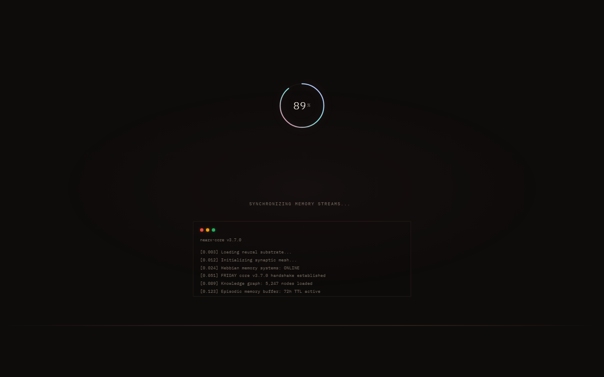

<div align="center">

# Agent Maxxing

**85+ production-ready skills, 19 UI components, and 7 system prompts for AI coding agents. One folder. Zero dependencies. Works everywhere.**

[](LICENSE)
[](#skills)
[](#components)
[](#system-prompts-fine-tune)
[](#compatible-agents)
[](#skills)
[](#)

<br>

> These skills follow the [Agent Skills specification](https://agentskills.io/specification) so they can be used by **any skills-compatible agent** — Claude Code, Codex, OpenCode, Cursor, and 60+ more.

<br>



</div>

---

## Why This Exists

AI coding agents are powerful but generic. They don't know your design system, your animation preferences, your typography rules, or how to make a meme. **Agent Skills fixes that** — drop these markdown files into your agent's skill directory and it instantly knows how to:

- Build premium UI with glassmorphism, motion design, and color theory
- Create memes, diagrams, and canvas art
- Write human-sounding text that strips AI-isms
- Harden interfaces for production
- Debug Python and Node.js like a senior engineer
- Self-improve its own skills over time

**No API keys. No npm install. No config. Just markdown.**

---

## Quick Install

### Claude Code

```bash
# Clone into your skills directory
git clone https://github.com/subhansh-dev/agent-skills.git ~/.claude/skills/agent-skills
```

### Codex

```bash
git clone https://github.com/subhansh-dev/agent-skills.git ~/.codex/skills/agent-skills
```

### OpenCode

```bash
git clone https://github.com/subhansh-dev/agent-skills.git ~/.opencode/skills/agent-skills
```

### npx skills (any agent)

```bash
npx skills add https://github.com/subhansh-dev/agent-skills
```

That's it. Your agent discovers all skills automatically on next session.

---

## Skills

### Frontend & Design

| Skill | Description |
|-------|-------------|
| [frontend-design](frontend-design/01-FRONTEND-DESIGN.md) | Build production-grade frontend interfaces with high design quality |
| [animate](frontend-design/02-ANIMATE.md) | Add purposeful animations, micro-interactions, and motion effects |
| [colorize](frontend-design/03-COLORIZE.md) | Add strategic color to monochromatic interfaces |
| [typeset](frontend-design/04-TYPESET.md) | Fix typography — font choices, hierarchy, sizing, weight consistency |
| [bolder](frontend-design/05-BOLDER.md) | Amplify safe designs to make them visually interesting |
| [delight](frontend-design/06-DELIGHT.md) | Add moments of joy and personality to interfaces |
| [polish](frontend-design/07-POLISH.md) | Final quality pass — alignment, spacing, consistency |
| [critique](frontend-design/08-CRITIQUE.md) | Evaluate design effectiveness from a UX perspective |
| [onboard](frontend-design/13-ONBOARD.md) | Design onboarding flows and first-time user experiences |
| [typography](frontend-design/typography.md) | Font pairing, scale, and typographic systems |
| [color-and-contrast](frontend-design/color-and-contrast.md) | Color theory, palettes, and accessibility contrast |
| [interaction-design](frontend-design/interaction-design.md) | Micro-interactions, hover states, and feedback patterns |
| [motion-design](frontend-design/motion-design.md) | Timing, easing, enter/exit patterns, performance |
| [responsive-design](frontend-design/responsive-design.md) | Breakpoints, fluid layouts, and mobile-first patterns |
| [spatial-design](frontend-design/spatial-design.md) | Layout, spacing, and visual rhythm |
| [ux-writing](frontend-design/ux-writing.md) | Microcopy, error messages, and clear interface text |

### Content & Writing

| Skill | Description |
|-------|-------------|
| [humanizer](content/09-HUMANIZER.md) | Strip AI-isms, add real voice to generated text |
| [clarify](content/04-CLARIFY.md) | Improve unclear UX copy and error messages |

### Diagrams & Visual

| Skill | Description |
|-------|-------------|
| [diagram-maker](visual/10-DIAGRAM-MAKER.md) | Create SVG, HTML, or Excalidraw diagrams and architecture visuals |
| [meme-maker](visual/11-MEME-MAKER.md) | Generate memes from curated template registry |
| [canvas](visual/12-CANVAS.md) | Canvas-based visual creation and generative art |
| [excalidraw-patterns](visual/excalidraw-patterns.md) | Hand-drawn Excalidraw diagram patterns and templates |
| [svg-template](visual/svg-template.md) | SVG generation templates and reusable patterns |

### Code & Engineering

| Skill | Description |
|-------|-------------|
| [code-generator](engineering/05-CODE-GENERATOR.md) | Generate code with best practices and patterns |
| [distill](engineering/06-DISTILL.md) | Strip designs to their essence by removing complexity |
| [extract](engineering/07-EXTRACT.md) | Extract reusable components and design tokens |
| [harden](engineering/10-HARDEN.md) | Improve interface resilience — error handling, edge cases |
| [normalize](engineering/12-NORMALIZE.md) | Normalize design to match your design system |
| [optimize](engineering/14-OPTIMIZE.md) | Improve performance — loading, rendering, bundle size |
| [overdrive](engineering/15-OVERDRIVE.md) | Push interfaces past conventional limits |
| [quieter](engineering/16-QUIETER.md) | Tone down overly bold or aggressive designs |
| [node-inspect-debugger](engineering/25-NODE-INSPECT-DEBUGGER.md) | Node.js debugging with inspect protocol |
| [python-debugpy](engineering/26-PYTHON-DEBUGPY.md) | Python remote debugging with debugpy |

### Agent Meta & Self-Improvement

| Skill | Description |
|-------|-------------|
| [self-improvement](agent-meta/17-SELF-IMPROVEMENT.md) | Agent self-improvement and learning loops |
| [skill-creator](agent-meta/18-SKILL-CREATOR.md) | Create new agent skills from scratch |
| [skill-vetter](agent-meta/19-SKILL-VETTER.md) | Validate and review agent skills |
| [skillhub-preference](agent-meta/20-SKILLHUB-PREFERENCE.md) | Skill discovery and preference ranking |
| [find-skills](agent-meta/08-FIND-SKILLS.md) | Search and discover available skills |
| [github](agent-meta/09-GITHUB.md) | GitHub integration and repository management |
| [teach-impeccable](agent-meta/24-TEACH-IMPECCABLE.md) | One-time setup for persistent design guidelines |

### Task Management & Workflows

| Skill | Description |
|-------|-------------|
| [taskflow](workflows/22-TASKFLOW.md) | Structured task management and execution |
| [taskflow-inbox-triage](workflows/23-TASKFLOW-INBOX-TRIAGE.md) | Inbox triage and priority management |
| [spike](workflows/21-SPIKE.md) | Quick prototyping and exploration spikes |
| [healthcheck](workflows/11-HEALTHCHECK.md) | System health monitoring and diagnostics |

### Adaptation & Learning

| Skill | Description |
|-------|-------------|
| [adapt](adaptation/01-ADAPT.md) | Adapt designs across screen sizes, devices, and platforms |
| [arrange](adaptation/02-ARRANGE.md) | Improve layout, spacing, and visual rhythm |
| [audit](adaptation/03-AUDIT.md) | Comprehensive audit — accessibility, performance, theming |

### System Prompts (Fine-Tune)

Extracted from leaked prompts of Claude Fable 5, GPT-5.5 Codex, Gemini CLI, and more.

| File | What It Improves |
|------|------------------|
| [fine-tune](system-prompts/00-FINE-TUNE.md) | Master instructions for using these prompts |
| [fable-5-base](system-prompts/01-fable-5-base.md) | Personality, memory, tone, refusal handling |
| [coding-excellence](system-prompts/02-coding-excellence.md) | Engineering judgment, code quality, editing |
| [reasoning-planning](system-prompts/03-reasoning-planning.md) | Thinking, planning, decision-making |
| [frontend-mastery](system-prompts/04-frontend-mastery.md) | UI/UX design rules, visual quality |
| [agent-orchestration](system-prompts/05-agent-orchestration.md) | Tool usage, sub-agents, delegation |
| [tone-communication](system-prompts/06-tone-communication.md) | Communication style, formatting |

---

## Compatible Agents

These skills work with **any agent that supports the [Agent Skills specification](https://agentskills.io/specification)**:

| Agent | Install Path |
|-------|-------------|
| **Claude Code** | `~/.claude/skills/` |
| **Codex CLI** | `~/.codex/skills/` |
| **OpenCode** | `~/.opencode/skills/` |
| **Cursor** | `.cursor/skills/` |
| **Continue** | `.continue/skills/` |
| **Kilo** | `.kilocode/skills/` |
| **OpenClaw** | `.openclaw/skills/` |
| **Pi Agent** | `.pi/skills/` |
| **Hermes** | `~/.hermes/skills/` |
| **60+ more** | Any SKILL.md-compatible agent |

---

## File Structure

```
agent-skills/
├── README.md                        ← you are here
├── LICENSE                          ← MIT
├── 00-OVERVIEW.md                   ← skill collection overview
├── 00-INDEX.md                      ← searchable skill index
│
├── frontend-design/                 ← 14 files · UI, CSS, motion, typography
│   ├── 01-FRONTEND-DESIGN.md
│   ├── 02-ANIMATE.md
│   ├── 03-COLORIZE.md
│   ├── 04-TYPESET.md
│   ├── 05-BOLDER.md
│   ├── 06-DELIGHT.md
│   ├── 07-POLISH.md
│   ├── 08-CRITIQUE.md
│   ├── 13-ONBOARD.md
│   ├── typography.md
│   ├── color-and-contrast.md
│   ├── interaction-design.md
│   ├── motion-design.md
│   ├── responsive-design.md
│   ├── spatial-design.md
│   └── ux-writing.md
│
├── content/                         ← 3 files · writing, copy, humanization
│   ├── 04-CLARIFY.md
│   ├── 09-HUMANIZER.md
│   └── ux-writing.md
│
├── visual/                          ← 6 files · diagrams, memes, canvas, SVG
│   ├── 10-DIAGRAM-MAKER.md
│   ├── 11-MEME-MAKER.md
│   ├── 12-CANVAS.md
│   ├── excalidraw-patterns.md
│   ├── svg-template.md
│   └── templates.json
│
├── engineering/                     ← 10 files · code, perf, hardening, debug
│   ├── 05-CODE-GENERATOR.md
│   ├── 06-DISTILL.md
│   ├── 07-EXTRACT.md
│   ├── 10-HARDEN.md
│   ├── 12-NORMALIZE.md
│   ├── 14-OPTIMIZE.md
│   ├── 15-OVERDRIVE.md
│   ├── 16-QUIETER.md
│   ├── 25-NODE-INSPECT-DEBUGGER.md
│   └── 26-PYTHON-DEBUGPY.md
│
├── agent-meta/                      ← 7 files · self-improvement, skills, discovery
│   ├── 08-FIND-SKILLS.md
│   ├── 09-GITHUB.md
│   ├── 17-SELF-IMPROVEMENT.md
│   ├── 18-SKILL-CREATOR.md
│   ├── 19-SKILL-VETTER.md
│   ├── 20-SKILLHUB-PREFERENCE.md
│   └── 24-TEACH-IMPECCABLE.md
│
├── workflows/                       ← 4 files · task management, triage, health
│   ├── 11-HEALTHCHECK.md
│   ├── 21-SPIKE.md
│   ├── 22-TASKFLOW.md
│   └── 23-TASKFLOW-INBOX-TRIAGE.md
│
├── adaptation/                      ← 3 files · cross-platform, layout, audit
│   ├── 01-ADAPT.md
│   ├── 02-ARRANGE.md
│   └── 03-AUDIT.md
│
├── components/                      ← 19 files · reusable UI component patterns
│   ├── glass-card.md
│   ├── gradient-button.md
│   ├── animated-input.md
│   ├── modal-dialog.md
│   ├── loading-skeleton.md
│   ├── toast-notification.md
│   ├── navbar.md
│   ├── data-table.md
│   ├── tooltip.md
│   ├── tabs.md
│   ├── dropdown.md
│   ├── avatar.md
│   ├── progress-bar.md
│   ├── badge-tag.md
│   ├── toggle-switch.md
│   ├── accordion.md
│   ├── breadcrumb.md
│   └── pagination.md
│
└── system-prompts/                 ← 7 files · extracted from top AI agents
    ├── 00-FINE-TUNE.md
    ├── 01-fable-5-base.md
    ├── 02-coding-excellence.md
    ├── 03-reasoning-planning.md
    ├── 04-frontend-mastery.md
    ├── 05-agent-orchestration.md
    └── 06-tone-communication.md
```

**9 folders. 95+ files. Zero dependencies. Just `.md` files your agent reads.**

> **New?** Start with [`FINE-TUNE-AGENT.md`](FINE-TUNE-AGENT.md) — the master instruction file that tells your agent how to use everything in this repo.

---

## Components

Reusable UI component patterns in the `components/` folder. Drop these into any project:

| Component | Description |
|-----------|-------------|
| [glass-card](components/glass-card.md) | Glassmorphism card with backdrop blur and mouse-tracking specular |
| [gradient-button](components/gradient-button.md) | Gradient buttons with hover glow and press feedback |
| [animated-input](components/animated-input.md) | Input fields with floating labels and focus animations |
| [modal-dialog](components/modal-dialog.md) | Modal with backdrop blur, spring animation, focus trap |
| [loading-skeleton](components/loading-skeleton.md) | Shimmer loading placeholders for content areas |
| [toast-notification](components/toast-notification.md) | Toast notifications with slide-in, auto-dismiss, stacking |
| [navbar](components/navbar.md) | Navigation bar with glass effect and scroll-aware styling |
| [data-table](components/data-table.md) | Data tables with sorting, striped rows, hover states |

---

## How It Works

1. Your agent reads the `SKILL.md` frontmatter to discover available skills
2. When a task matches a skill's description, the agent loads it as context
3. The skill provides structured instructions, patterns, and constraints
4. The agent follows the skill's guidance to produce better output

```
User: "Make this landing page more premium"
        ↓
Agent: Loads frontend-design skill → applies glassmorphism, motion, typography rules
        ↓
Result: Premium UI that doesn't look like AI generated it
```

---

## Contributing

Skills are just markdown files. To add one:

1. Create `XX-YOUR-SKILL.md` with YAML frontmatter
2. Follow the [Agent Skills spec](https://agentskills.io/specification)
3. Include: name, description, trigger conditions, structured instructions
4. Test with Claude Code, Codex, or any compatible agent
5. Open a PR

### Skill Template

```markdown
---
name: your-skill
description: One-line description of what this skill does
---

# Your Skill Name

## When to Use
- Trigger condition 1
- Trigger condition 2

## Instructions
1. Step one
2. Step two

## Rules
- Rule 1
- Rule 2
```

---

## Integration Guide

### Step 1: Clone the repo

```bash
git clone https://github.com/subhansh-dev/agent-skills.git
```

### Step 2: Copy to your agent's skill directory

**Claude Code:**
```bash
cp -r agent-skills/* ~/.claude/skills/
```

**Codex CLI:**
```bash
cp -r agent-skills/* ~/.codex/skills/
```

**OpenCode:**
```bash
cp -r agent-skills/* ~/.opencode/skills/
```

**Cursor:**
```bash
cp -r agent-skills/* .cursor/skills/
```

### Step 3: Restart your agent

The agent auto-discovers all `.md` files with YAML frontmatter on next session.

### Step 4: Use the skills

Just describe what you want. The agent picks the right skill automatically:

```
"Build a landing page with glassmorphism"
→ Loads frontend-design + glass-card

"Write a blog post that sounds human"
→ Loads humanizer

"Create a diagram of the system architecture"
→ Loads diagram-maker
```

---

## Permanent Agent Integration

Add this prompt to your agent's system prompt or `CLAUDE.md` / `AGENTS.md` to permanently load these skills:

```markdown
## Design & Engineering Skills

You have access to a collection of 40+ agent skills at `~/.claude/skills/agent-skills/` (adjust path for your agent).

When working on any task, check if a relevant skill exists before generating output:

### Frontend Work
- `frontend-design/01-FRONTEND-DESIGN.md` — premium UI patterns, glassmorphism, anti-slop rules
- `frontend-design/02-ANIMATE.md` — motion design, micro-interactions
- `frontend-design/03-COLORIZE.md` — color theory and palette generation
- `frontend-design/04-TYPESET.md` — typography systems and font pairing
- `frontend-design/07-POLISH.md` — final quality pass

### Content Work
- `content/09-HUMANIZER.md` — strip AI-isms, add real voice

### Visual Work
- `visual/10-DIAGRAM-MAKER.md` — SVG/HTML/Excalidraw diagrams
- `visual/11-MEME-MAKER.md` — meme generation
- `visual/12-CANVAS.md` — canvas-based visual creation

### Engineering Work
- `engineering/10-HARDEN.md` — error handling, edge cases, resilience
- `engineering/14-OPTIMIZE.md` — performance optimization
- `engineering/26-PYTHON-DEBUGPY.md` — Python debugging

### Design Rules (always apply)
1. Pure black backgrounds (#010103, #06060a), NEVER grey
2. Glass aesthetic: backdrop-filter: blur(20px) saturate(1.3)
3. Bright specular edges: rgba(255,255,255,0.12-0.2)
4. SVG icons over emojis — always use inline SVGs
5. Max 1 accent color, saturation < 80%
6. Typography: Geist, Outfit, Satoshi — NOT Inter for everything
```

---

## License

MIT License — use these skills anywhere, no restrictions.

---

<div align="center">

**Built for agents, by a 17-year-old who got tired of generic AI output.**

[](https://github.com/subhansh-dev)

</div>
